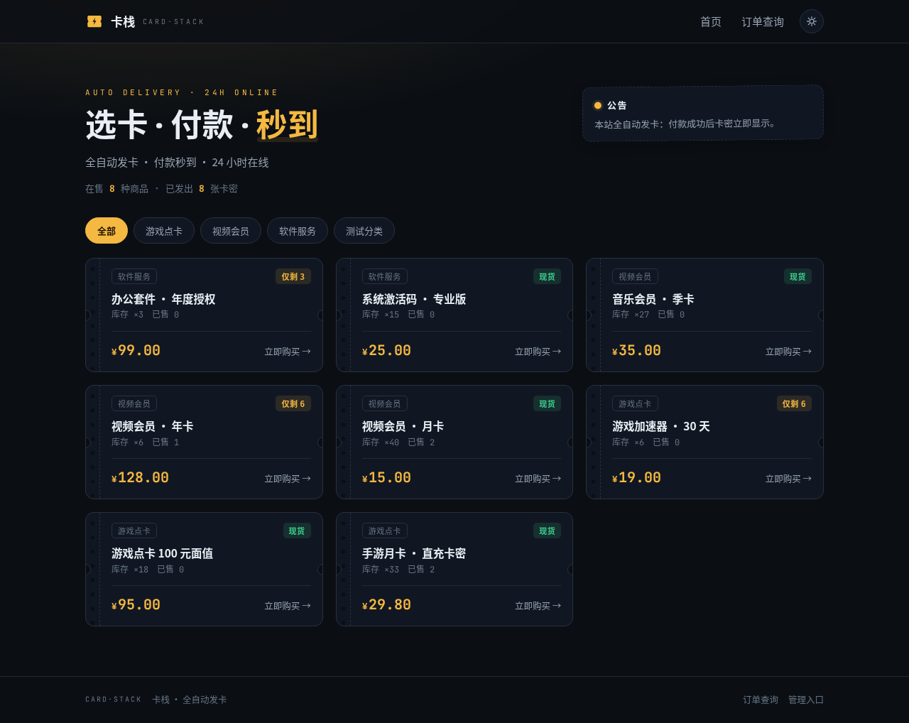
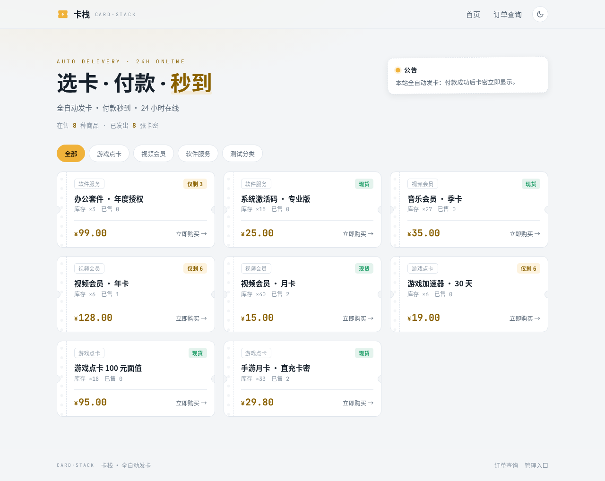
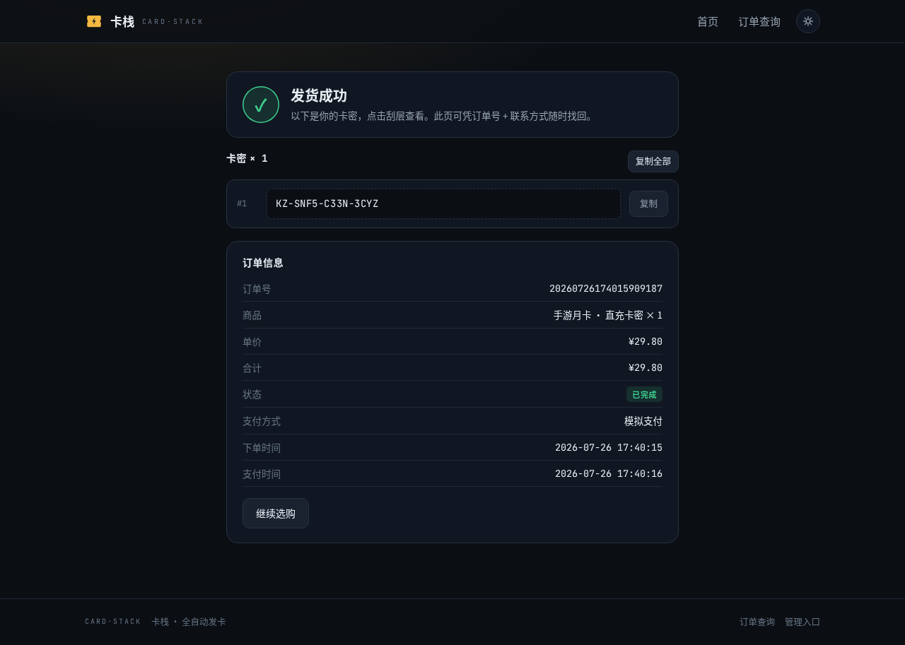
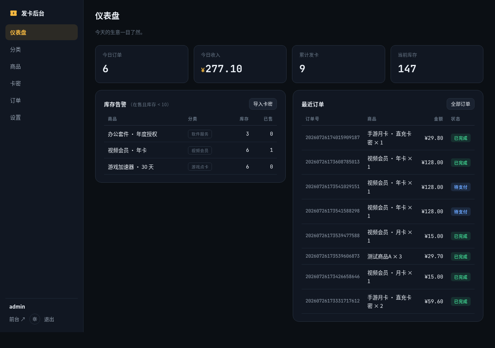

# 潇洒哥的卡台 · 自动发卡网

单商户自动发卡站：买家选卡 → 付款 → **秒发卡密**。Rust 单二进制 + SQLite 单文件，无需 Node、无需外部数据库，一条命令跑起来。



## 功能

**买家端**：分类浏览、票券式商品卡（支持商品配图）、下单锁库存（防超卖）、15 分钟支付倒计时、支付状态自动轮询跳转、卡密「刮开查看」+ 一键复制、订单查询找回卡密、暗/亮双主题切换。

**管理端**（私密路径，见下）：仪表盘（今日订单/收入、库存告警、待补发提醒）、分类管理、商品管理（上下架/排序/弹窗编辑/图片上传）、卡密批量导入（自动去重）、订单管理（搜索/人工补单/缺货补发）、三大列表分页 + 全选批量删除、邮件通知设置、站点与支付设置、修改密码。

**邮件通知**：发货成功自动把卡密寄给买家，缺货待补发时寄一封提醒给店主自己（详见下文）。

**支付**：内置两种模式，后台一键切换——
- `模拟支付`（默认）：本地演示用，点击即付款成功，走完整发卡流程；
- `易支付 (epay)`：正式收款用，MD5 签名跳转收银台，异步回调验签（签名 + 交易状态 + 金额三重校验）后自动发卡。

## 快速开始

```bash
cargo run            # 开发运行，默认 http://localhost:8080
# 或
cargo build --release && ./target/release/kazhan
```

首次启动自动建库（`data.db`）并写入演示分类/商品/卡密，打开即可体验完整流程。

**后台入口是一段随机私密路径**：首次启动时自动生成 6 位随机字符串（如 `/k3m9xz`）并存入数据库，启动日志会打印完整地址——

```
管理后台入口: http://127.0.0.1:8080/k3m9xz  （该路径为私密地址，请勿外泄）
```

站点任何公开页面都不会出现这个地址，猜不到就进不去。可在「设置 → 后台私密路径」随时更换（重启后生效）；万一忘记，用环境变量 `ADMIN_PATH=xxxxxx` 启动即可临时指定。

| 项 | 默认值 |
|---|---|
| 前台 | http://localhost:8080 |
| 后台 | 见启动日志打印的私密路径 |
| 账号 | 首次启动创建默认管理员，**上线前务必在后台改密** |
| 端口 | 环境变量 `PORT`（默认 8080） |
| 数据库 | 环境变量 `DB_PATH`（默认 `./data.db`） |
| 图片目录 | 环境变量 `UPLOAD_DIR`（默认 `./uploads`） |
| 后台路径 | 环境变量 `ADMIN_PATH`（留空则用数据库中的值） |

> Windows 下构建需安装 Rust（rustup）与 Visual Studio Build Tools（Rust 安装器会提示）；Linux 需 `gcc`。SQLite 已内置编译（bundled），无需单独安装。

## 接入易支付收款

1. 后台 → **设置 → 支付设置**；
2. 「站点对外地址」填你的公网域名（如 `https://shop.example.com`，用于回调，末尾不带 `/`）；
3. 支付模式切换为「易支付」，填入服务商提供的 **网关地址**（不带 `/submit.php`）、**商户 PID**、**商户密钥 KEY**；
4. 勾选「收银台支付通道」：勾几个收银台就出几个按钮。**只勾你在易支付商户后台确实开通了的通道**，没开通的买家点了会在对方页面报错。两个都不勾时收银台只出一个「其他方式」按钮，提交时不指定通道，由易支付自家收银台列出你实际开通的方式让买家选——拿不准开了哪些就这么设；
5. 保存后异步通知地址为 `站点地址/api/pay/epay/notify`，验签失败、金额不符、非 `TRADE_SUCCESS` 的通知一律拒绝。

买家付款后若订单恰好超时被释放且库存不足，订单会标记为「已付待补发」，仪表盘红条提醒，补货后在订单页一键补发。

## 配置邮件通知

后台 → **设置 → 邮件通知（SMTP）**，勾选「启用邮件通知」并填写服务器信息，保存后用同页的「发送测试邮件」验证一次即可。密码框留空表示沿用已保存的密码，页面永远不回显密码原文。

| 服务商 | 服务器 | 端口 / 加密 | 密码填什么 |
|---|---|---|---|
| QQ 邮箱 | smtp.qq.com | 465 / SSL | 授权码（不是登录密码） |
| 163 邮箱 | smtp.163.com | 465 / SSL | 授权码 |
| Gmail | smtp.gmail.com | 587 / STARTTLS | 应用专用密码 |

「发件人邮箱」通常必须与登录账号一致，否则多数服务商会拒信。「店主收件邮箱」用于接收缺货提醒，留空则不发提醒。

两个发信时机：**发货成功**时给买家寄卡密（含取卡链接），**缺货待补发**时给店主寄提醒。发信在后台异步进行，SMTP 挂掉只写日志、绝不拖慢或阻断发货。

## 日常运营

上架流程：`分类` 建分类 → `商品` 新增商品定价（可顺手传一张配图）→ `卡密` 批量导入（一行一张，重复行自动跳过）→ 前台即时可售。库存 = 未售卡密数，全部由系统自动扣减：下单锁定、付款转已售、超时释放。

商品图片：新增/编辑商品时可直接上传 PNG / JPG / WEBP / GIF（≤ 2MB），也可改填外链地址；上传的图按内容嗅探真实格式、重命名后存入 `uploads/`，替换或勾选「移除当前图片」时旧文件自动清理。不传图的商品前台照常显示，只是没有配图区。

批量整理：商品、卡密、订单三个列表都是每页 50 条并带分页条，表头的复选框可全选本页，勾好后点「批量删除」一次清掉。翻页、搜索、筛选条件在删除后会原样带回，不用重新选一遍。已售或锁定中的卡密受保护、不会被删（结果提示会告诉你跳过了几张）；删除订单会连带释放它锁定的卡密，那些卡密重新回到在售。

备份：停机复制 `data.db`（或连同 `data.db-wal`）与 `uploads/` 目录即可。

## 目录结构

```
src/            后端（Axum 路由 / 业务模型 / 支付 / 鉴权 / 运行时配置 / 图片上传）
templates/      Askama 模板（编译期校验）
static/         样式、交互脚本、自托管字体、图标
uploads/        商品图片（运行时生成，不入版本库）
docs/           设计计划见 PLAN.md，界面截图见 docs/screenshots/
```

| 暗色「墨夜」 | 亮色「素笺」 |
|---|---|
|  |  |

| 取卡页（刮开显码） | 管理后台 |
|---|---|
|  |  |

## 安全说明

后台入口为随机私密路径，公开页面不含任何链接，错误路径直接落到 404；后台会话 Cookie 的 `Path` 限定在该私密路径下，前台请求根本拿不到它。登录失败按 IP 限速：同一 IP 连续 5 次失败锁定 10 分钟（反代下取 `X-Forwarded-For`）。

管理口令 bcrypt 哈希存储；会话 HttpOnly Cookie（7 天）；改密后全部会话失效；卡密页需订单号 + 联系方式双凭证。

图片上传只认 PNG / JPG / WEBP / GIF 的文件头（改扩展名的脚本会被拒），单张上限 2MB、请求体上限 6MB，文件名由服务端随机生成，`uploads/` 目录只做静态读取、不执行任何内容。

生产部署建议置于 HTTPS 反代（Nginx / Caddy）之后，并把 `client_max_body_size` 调到 5m 以上以免上传被反代拦下。
